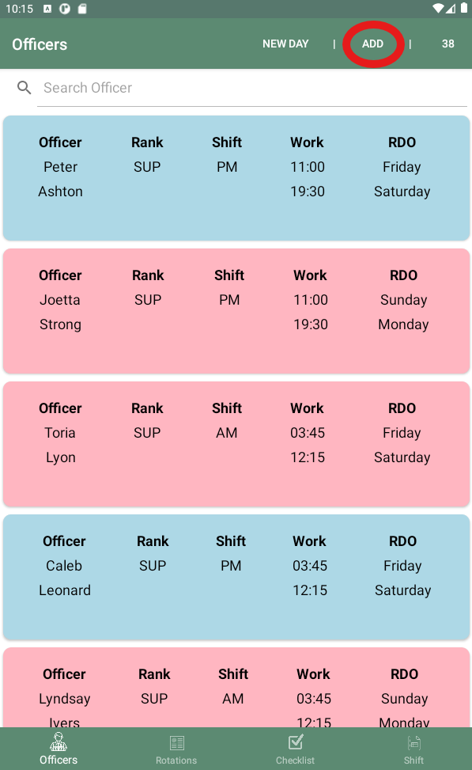
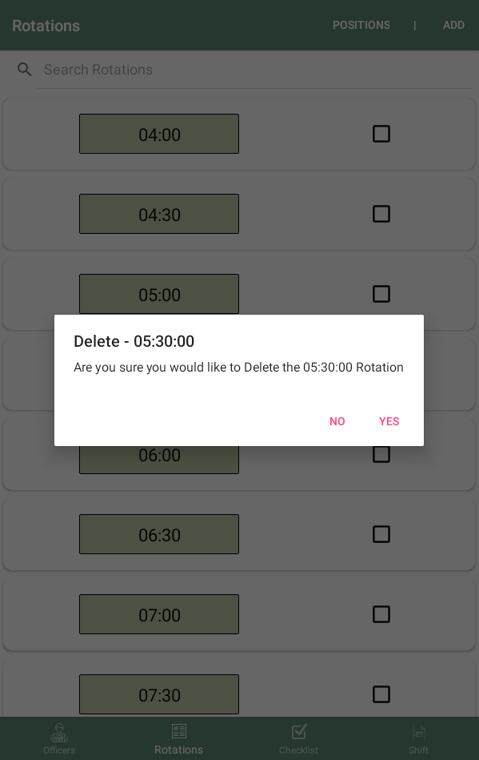
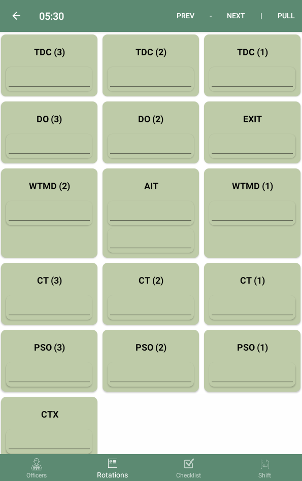
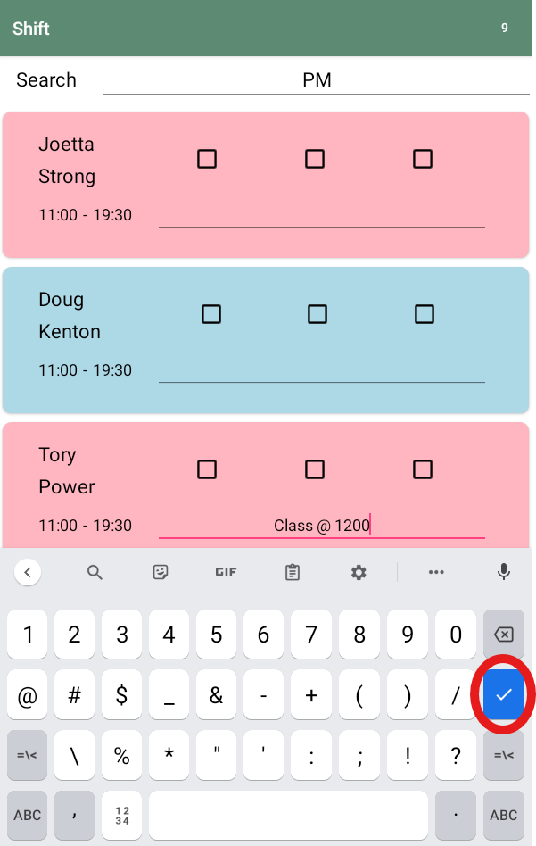
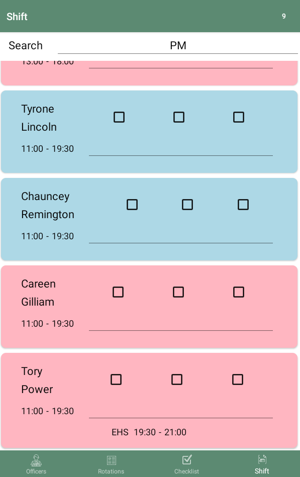

# Table of Contents

1. [Officers Page](https://github.com/bd3young/TeamLeadApp?tab=readme-ov-file#officers-page)
   -  [How to Add an Officer](https://github.com/bd3young/TeamLeadApp/blob/master/README.md#how-to-add-an-officer)
   -  [How to Edit an Officer](https://github.com/bd3young/TeamLeadApp/blob/master/README.md#how-to-edit-an-officer)
   -  [How to Delete an Officer](https://github.com/bd3young/TeamLeadApp/blob/master/README.md#how-to-delete-an-officer)
   -  [How to Put An Officer On Extra Hours](https://github.com/bd3young/TeamLeadApp/blob/master/README.md#how-to-put-an-officer-on-extra-hours)
3. [Roltations Page](https://github.com/bd3young/TeamLeadApp?tab=readme-ov-file#rotations-page)
   -  [How To Add a Rotation](https://github.com/bd3young/TeamLeadApp/blob/master/README.md#how-to-add-a-rotation)
   -  [How To Edit a Rotation](https://github.com/bd3young/TeamLeadApp/blob/master/README.md#how-to-edit-a-rotation)
   -  [How To Delete a Rotation](https://github.com/bd3young/TeamLeadApp/blob/master/README.md#how-to-delete-a-rotation)
   -  [Positions List Page](https://github.com/bd3young/TeamLeadApp/blob/master/README.md#positions-list-page)
      -  [How To Add a Position](https://github.com/bd3young/TeamLeadApp/blob/master/README.md#how-to-add-a-position)
      -  [How To Edit a Position](https://github.com/bd3young/TeamLeadApp/blob/master/README.md#how-to-edit-a-position)
      -  [How To Delete a Position](https://github.com/bd3young/TeamLeadApp/blob/master/README.md#how-to-delete-a-position)
   -  [Rotation Positions Page](https://github.com/bd3young/TeamLeadApp/blob/master/README.md#rotation-positions-page)
      -  [How To Assign an Officer To a Position](https://github.com/bd3young/TeamLeadApp/blob/master/README.md#how-to-assign-an-officer-to-a-position)
      -  [How To Clear a Position That Is No Longer Filled](https://github.com/bd3young/TeamLeadApp/blob/master/README.md#how-to-clear-a-position-that-is-no-longer-filled)
      -  [How to Navigate to the Previous Rotation](https://github.com/bd3young/TeamLeadApp/blob/master/README.md#how-to-navigate-to-the-previous-rotation)
      -  [How to Navigate to the Next Rotation](https://github.com/bd3young/TeamLeadApp/blob/master/README.md#how-to-navigate-to-the-next-rotation)
      -  [How to Pull a Previous Rotation](https://github.com/bd3young/TeamLeadApp/blob/master/README.md#how-to-pull-a-previous-rotation)
5. [Checklist Page](https://github.com/bd3young/TeamLeadApp?tab=readme-ov-file#checklist-page)
   -  [How To Add a Task](https://github.com/bd3young/TeamLeadApp/blob/master/README.md#how-to-add-a-task)
   -  [How To Edit a Task](https://github.com/bd3young/TeamLeadApp/blob/master/README.md#how-to-edit-a-task)
   -  [How To Delete a Task](https://github.com/bd3young/TeamLeadApp/blob/master/README.md#how-to-delete-a-task)
   -  [How To Complete a Task](https://github.com/bd3young/TeamLeadApp/blob/master/README.md#how-to-complete-a-task)
   -  [How To Add a Completion Time To a Task](https://github.com/bd3young/TeamLeadApp/blob/master/README.md#how-to-add-a-completion-time-to-a-task)
7. [Shift Page](https://github.com/bd3young/TeamLeadApp?tab=readme-ov-file#shift-page)
   -  [How To Filter Shifts](https://github.com/bd3young/TeamLeadApp/blob/master/README.md#how-to-filter-shifts)
   -  [How To Give An Officer a Break/Lunch](https://github.com/bd3young/TeamLeadApp/blob/master/README.md#how-to-give-an-officer-a-breaklunch)
   -  [How To Type Notes On An Officer](https://github.com/bd3young/TeamLeadApp/blob/master/README.md#how-to-type-notes-on-an-officer)
   -  [How To Put An Officer On Leave](https://github.com/bd3young/TeamLeadApp/blob/master/README.md#how-to-put-an-officer-on-leave)
   -  [How To Put An Officer On Extra Hours](https://github.com/bd3young/TeamLeadApp/blob/master/README.md#how-to-put-an-officer-on-extra-hours-1)

# TeamLead

An Application used to automate the creation of shift sheets and make creating rotations easy for the User. 

## Key Features

- Add, Edit, and Delete Officers
- Add, Edit, and Delete Checklist Tasks
- Add, Edit, and Delete Rotations
- Add, Edit, and Delete Postions
- Creates a lists of currently working Officers, that can also be filtered by AM, PM, MID, and LIVE shifts
- Keeps track of notes on Officers
- Keeps track of breaks and lunchs
- Keeps track of tasks throught the day
- Allows the user to create rotations that have lists of positions
- Allows currently working Officers the be assaigned to positions within a rotation

## How To Use

### [Officers Page](https://github.com/bd3young/TeamLeadApp/blob/master/README.md#table-of-contents)

This page allows the user to add, edit, delete, place on extra hours, and search officers. The top right hand corner of the page displays the total number of officers.

#### [How To Add An Officer](https://github.com/bd3young/TeamLeadApp/blob/master/README.md#table-of-contents)

Tap the ADD button that is in the top right of the screen. After completing all of the information tap the save button to save the officer. If you dont want to save the officer tap the cancel button to cancel the action.

Note - All portions of the Add Officer form must be filled out to be able to save. Also the Admin checkbox is used for Officers that don't regularly work in a rotation but can be added to it by putting them on extra hours. this check ox defaults to unchecked.

#### [How To Edit An Officer](https://github.com/bd3young/TeamLeadApp/blob/master/README.md#table-of-contents)

Find the Officer to edit and swipe left on the officers banner. Tap the EDIT option to edit that current Officer. Tap the save button when you are done editing or cancel if you want to cancel the edit. 

#### [How To Delete An Officer](https://github.com/bd3young/TeamLeadApp/blob/master/README.md#table-of-contents)

Find the Officer to delete and swipe left on the officers banner. Tap the DELETE option to delete that current Officer. Tap the Yes option to confirm the deletion of the officer or No to cancel the deletion.

#### [How To Put An Officer On Extra Hours](https://github.com/bd3young/TeamLeadApp/blob/master/README.md#table-of-contents)

Find the Officer to put on extra hours and swipe left on the officers banner. Tap the EHS option and confirm your selection. Tap how many breaks the Officer will be recieveing. Next enter the time the officer will begin extra hours and end extra hours. The Officer will now be displayed on the Shift page with the proper extra hours begin and end time displayed.

Note - The user cannot place an officer on extra hours during their shift. The user can place officers on extra hours before and after their shift. If the officer is off the day you place them on extra hours, the user can place the officer on extra hours at any time.

### [Rotations Page](https://github.com/bd3young/TeamLeadApp/blob/master/README.md#table-of-contents)

This page allows the user to see all the rotations added in the app. You can search for specific rotations using the search bar. Each rotation will have the time of the rotation and a completion checkbox. After the user completes a rotation they can check the box to indicate it's completion. The top right corner has two buttons. The Positions button takes you to the positions page and the Add button allows you to add rotations. Upon rotations being added they will automatically be populated with the positions from the positions page.

#### [How To Add a Rotation](https://github.com/bd3young/TeamLeadApp/blob/master/README.md#table-of-contents)

Click the Add button in the Top right corner of the page. Select the time of the rotation. After selecting the time of the rotation tap save if you would like to save or cancel if you want to cancel the action.

Note - Rotation times must be in 30 minute increments and must end with a 00 or 30.

#### [How to Edit a Rotation](https://github.com/bd3young/TeamLeadApp/blob/master/README.md#table-of-contents)

Find the Rotation to edit and swipe left on the Rotations banner. Tap the EDIT option to edit that current Rotation. When you are done editing tap the save button when you are done or cancel if you want to cancel the edit. 

#### [How to Delete a Rotation](https://github.com/bd3young/TeamLeadApp/blob/master/README.md#table-of-contents) 

Find the Rotation to delete and swipe left on the Rotations banner. Tap the DELETE option to delete that current Rotation. Tap the Yes option to confirm the deletion of the Rotation or No to cancel the deletion.

#### [Positions List Page](https://github.com/bd3young/TeamLeadApp/blob/master/README.md#table-of-contents)

This page allows the user to add, edit, and delete positions. The Two officers check box for a position indicates if the positions can have Two officers in it.

Note - When a position is added, edited, or deleted the actions is done for every position in every rotation.

##### [How To Add a Position](https://github.com/bd3young/TeamLeadApp/blob/master/README.md#table-of-contents) 

Tap the ADD button that is in the top right of the screen. After completing all of the information tap the save button to save the position. If you dont want to save the position tap the cancel button to cancel the action.

##### [How To Edit a Position](https://github.com/bd3young/TeamLeadApp/blob/master/README.md#table-of-contents)

Find the Position to edit and swipe left on the positions banner. Tap the EDIT option to edit that current Position. Tap the save button when you are done editing or cancel if you want to cancel the edit.

##### [How To Delete a Position](https://github.com/bd3young/TeamLeadApp/blob/master/README.md#table-of-contents)

Find the Position to delete and swipe left on the positions banner. Tap the DELETE option to delete that current Position. Tap the Yes option to confirm the deletion of the officer or No to cancel the deletion.

#### [Rotation Positions Page](https://github.com/bd3young/TeamLeadApp/blob/master/README.md#table-of-contents)

After selecting A rotation the user will land on the Rotation Positions Page. This page allows the user to assign currently working officers to a position.

##### [How To Assign An Officer To a Position](https://github.com/bd3young/TeamLeadApp/blob/master/README.md#table-of-contents) 

Tap underneath the positions name and select the officer you would like to assign to the position.

Note - Only officers that are currently working and are not in a position will be selectable.

##### [How To Clear a Position that is No Longer Filled](https://github.com/bd3young/TeamLeadApp/blob/master/README.md#table-of-contents)

Tap the name of the Position and confirm that you would like to clear the position.

##### [How to Navigate to the Previous Rotation](https://github.com/bd3young/TeamLeadApp/blob/master/README.md#table-of-contents)

##### [How to Navigate to the Next Rotation](https://github.com/bd3young/TeamLeadApp/blob/master/README.md#table-of-contents)

#### [How to Pull a Previous Rotation](https://github.com/bd3young/TeamLeadApp/blob/master/README.md#table-of-contents)

### [Checklist Page](https://github.com/bd3young/TeamLeadApp/blob/master/README.md#table-of-contents)

This page alows the user to add, edit, and delete tasks.

#### [How To Add a Task](https://github.com/bd3young/TeamLeadApp/blob/master/README.md#table-of-contents)

Tap the ADD button that is in the top right of the screen. After completing all of the information tap the save button to save the task. If you dont want to save the task tap the cancel button to cancel the action.

#### [How To Edit a Task](https://github.com/bd3young/TeamLeadApp/blob/master/README.md#table-of-contents)

Find the Task to edit and swipe left on the Tasks banner. Tap the EDIT option to edit that current Task. Tap the save button when you are done editing or cancel if you want to cancel the edit.

#### [How to Delete a Task](https://github.com/bd3young/TeamLeadApp/blob/master/README.md#table-of-contents)

Find the Task to delete and swipe left on the Tasks banner. Tap the DELETE option to delete that current Task. Tap the Yes option to confirm the deletion of the Task or No to cancel the deletion.

#### [How To Complete a Task](https://github.com/bd3young/TeamLeadApp/blob/master/README.md#table-of-contents)

Tap on the checkbox next to the Task name that you would like to complete.

#### [How To Add a Completion Time To a Task](https://github.com/bd3young/TeamLeadApp/blob/master/README.md#table-of-contents)

Tap on the time entry to the right of the checkbox. Enter your desired time and tap ok to save. Tap cancel if you want to cancel.

Note - Tasks will automatically have a completion time of 1200am.

### [Shift page](https://github.com/bd3young/TeamLeadApp/blob/master/README.md#table-of-contents)

This page creates lists of currently working Officers. The top right corner of the page will display the number of Officers in the lists. You can use the search bar to filter officers by their shift as well as a LIVE filter. The LIVE filter will contain only officers that are currently working.

#### [How to Filter Shifts](https://github.com/bd3young/TeamLeadApp/blob/master/README.md#table-of-contents)

#### [How To Give An Officer a Break/Lunch](https://github.com/bd3young/TeamLeadApp/blob/master/README.md#table-of-contents)

Tap on one of the three checkboxes next to the Officers name that you would like to give the Break/Lunch.

#### [How To Type Notes On An Officer](https://github.com/bd3young/TeamLeadApp/blob/master/README.md#table-of-contents)

Tap on the line next to the Officers shift times. Type the notes you want to take. Tap the check mark on the keyboard to save your notes.

#### [How To Put An Officer On Leave](https://github.com/bd3young/TeamLeadApp/blob/master/README.md#table-of-contents)

Find the Officer to put on leave and swipe left on the Officers banner. Tap the LV option and confirm that you would like to put the officer on leave.

Tap the hours option if you would like to place the officer on partial leave. After entering the leave begin time and end time tap save. The Officer will now be displayed on the Shift page with the inputted leave begin and end time displayed.

Tap the day option to place the officer on leave for their entire shift. This option will also take the officer out of the shift page.

#### [How To Put An Officer On Extra Hours](https://github.com/bd3young/TeamLeadApp/blob/master/README.md#table-of-contents)

Find the Officer to put on extra hours and swipe left on the officers banner. Tap the EHS option and confirm your selection. Next enter the time the officer will begin extra hours and end extra hours. The Officer will now be displayed on the Shift page with the inputted extra hours begin and end hours displayed.

Note - The user cannot place an officer on extra hours during their shift. The user can place officers on extra hours before and after their shift. If the officer is off the day you place them on extra hours, the user can place the officer on extra hours at any time.
